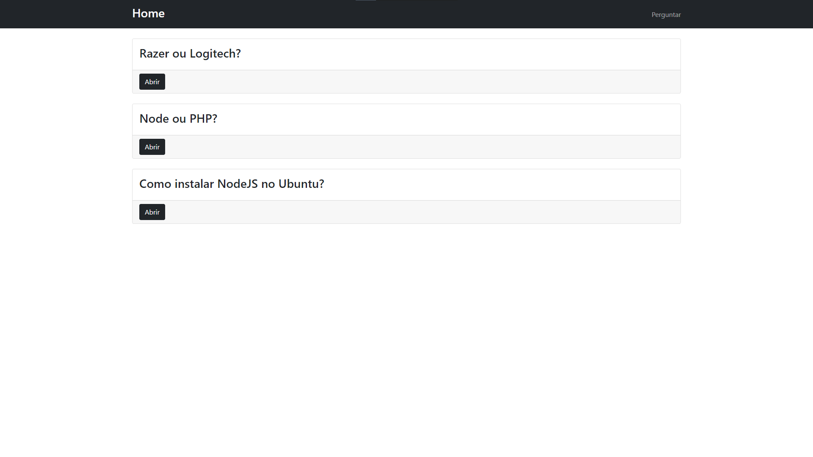

# ❔ Perguntas e Respostas

## ℹ Sobre

Servidor desenvolvido durante o curso Formação NodeJS com o intuito de desenvolver minhas habilidades em NodeJS.

O usuário tem capacidade de fazer e responder perguntas de forma anônima.

## 🛠 Tecnologias Utilizadas

- NodeJS
- Express
- Sequelize
- EJS

## 🌐 Web

Interface Web, onde o EJS foi utilizado para renderizar as páginas.



## 👨‍💻 Como utilizar

É necessário ter o NodeJS instalado na sua máquina, além de um gerenciador de pacotes, como o npm ou yarn para executar o servidor.

Além disso, o banco de dados deve estar configurado e rodando no momento da execução.

```sh
# Para instalar todas as dependências, execute:
$ yarn
# Para iniciar a aplicação, execute
$ yarn dev
```

## 📄 Licença

Hospedado sob a licença MIT.
